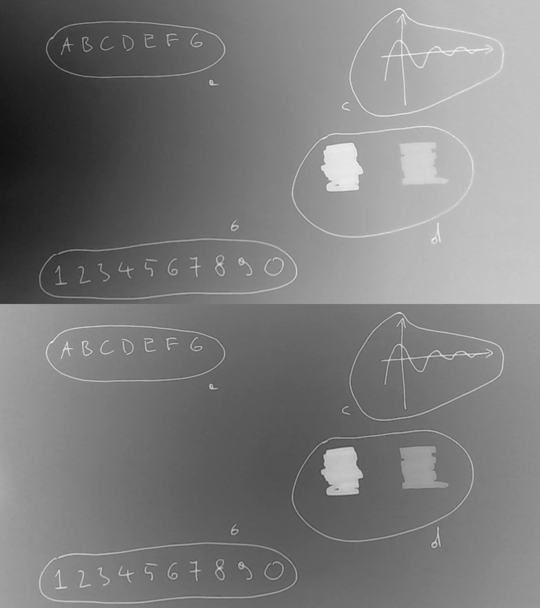
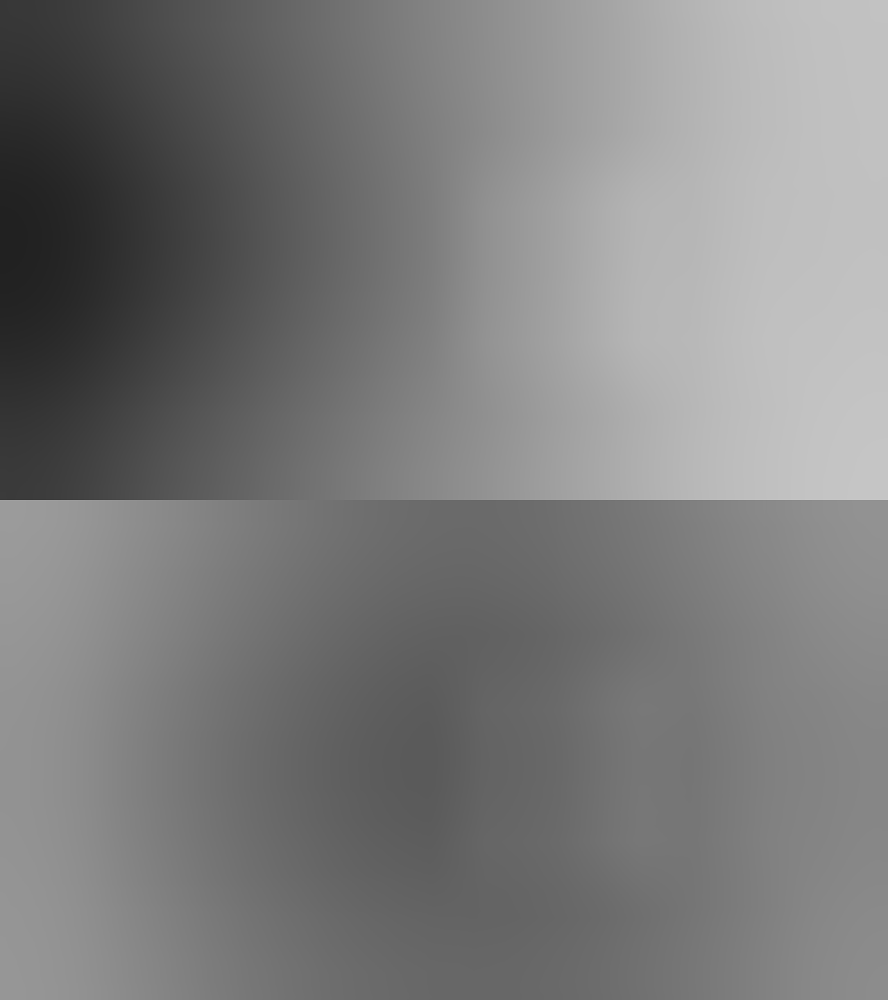
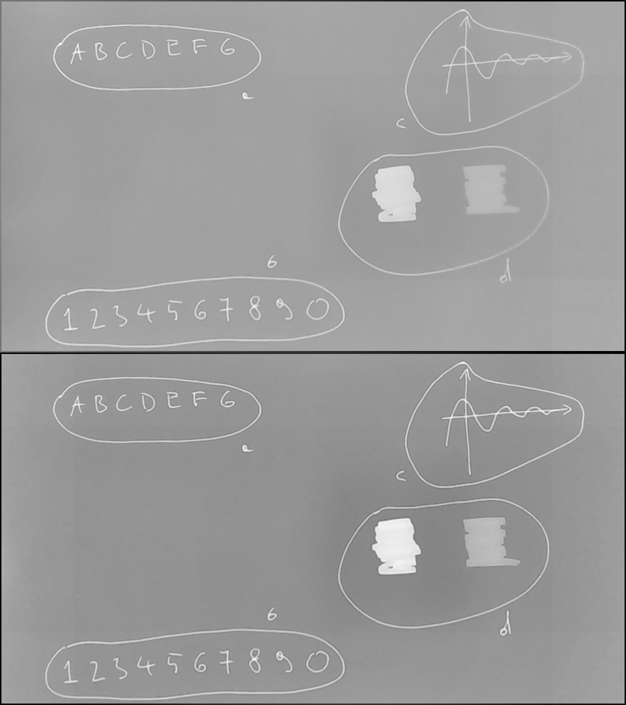
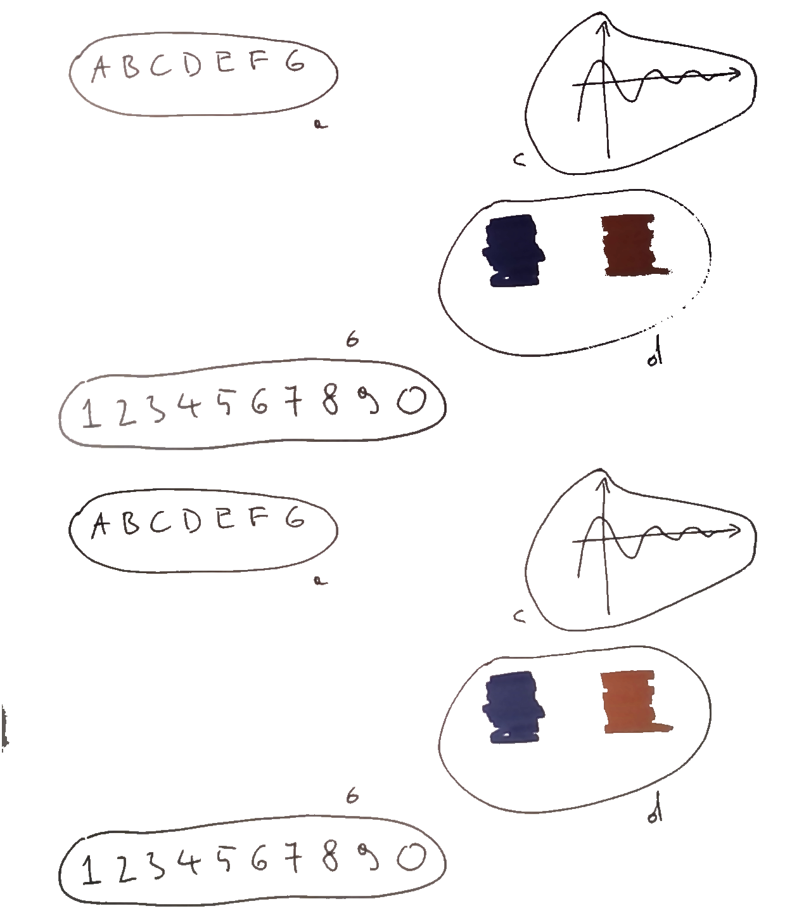

# image denoising with python
<center>
*2021-01-27*
</center>

remove text background with cv2 and numpy ...


I'm a big fan of the <a id = "NCE" href = https://www.camscanner.com/>CamScanner</a> app
and have been using this program on my phone ever since a friend introduced it to me many years ago.
You take a snapshot of a piece of paper and *CamScanner* will produce
a pdf with crisp, very readable, text and the background removed. I wanted to add this functionality to my <a id = "NCE" href = https://github.com/kacpertopol/cam_board>
cam_board</a> script (the name is homage to *CamScanner*) and after a lot of experimentation I believe I finally
have a simple solution.
Below is a description of the resulting procedure. It is an abridged version of the algorithm inside `cam_board`.
The line numbers correspond to the `denoise.py` file available <a id = "NCE" href = https://github.com/kacpertopol/denoise>here</a>.

First some imports
\[denoise.py line: 27\] 

```python
import argparse
import cv2
import numpy
```

The `argparse` library will be used to parse the command line arguments. This might be
overkill since there will be only one argument - the name of the image (without the extension)
that will undergo the denoising procedure. The `cv2` library in conjunction with the `numpy` library
will be used to perform image manipulations.

Next the single command line argument is parsed
and it will be available in `args.input`
\[denoise.py line: 42\] 

```python
parser = argparse.ArgumentParser(description = "Denoise image.")
parser.add_argument("input" , help = "Input image name (without extension)")
args = parser.parse_args() 
```

Note that the image name
is expected not to contain the extension, e.g.instead of `warped1.png`
the command line expects `warped1`.

The image is read using the `cv2.imread` function
\[denoise.py line: 67\] 

```python
warped = cv2.imread(args.input + ".png")
```


The <a id = "NCE" href = https://github.com/kacpertopol/denoise>denoise repository</a>
contains four sample images: `warped1...4.png` that were "warped" inside
`cam_board` (web cam frames are morphed so that four special markers showing up on a
printout are stretched to the four corners of the image). Here we will use `warped1.png`
and `warped4.png`. Each image contains some text (a), some numbers (b), a simple graph (c)
and two patches of color (d).

<center>

</center>

Notice that the the image on the top has the light shining on it differently then the
image on the bottom.

In the next step the image is turned into grayscale (`cv2.COLOR_BGR2GRAY`)
\[denoise.py line: 88\] 

```python
gray = cv2.cvtColor(warped , cv2.COLOR_BGR2GRAY) 
```

Dark areas of the image will be treated as the "signal" and pixels in these areas should
have hight color values. This is achieved through color inversion
\[denoise.py line: 91\] 

```python
gray = 255 - gray
```

This intermediate result is written to a file
\[denoise.py line: 96\] 

```python
cv2.imwrite(args.input + "_gray.png" , gray)
```

and here is the result:

<center>

</center>

Now it is time to take care of the background. But first, the `gray` image will be turned
into a floating point array
\[denoise.py line: 124\] 

```python
gray = gray.astype("float32")
```

This is usefull since we are about to apply many floating operations to this array of pixels.

A square image filtering kernel is created
\[denoise.py line: 128\] :

```python
blur_kernel = numpy.ones((300 , 300) , dtype = numpy.float32) 
blur_kernel = blur_kernel / numpy.sum(blur_kernel.flatten())
```

Notice that in the second line it is divided by the number of elements (albeit not in the most efficient way :-), I'll have to
fix this in `cam_board`) and applied to the `gray` image
\[denoise.py line: 133\] 

```python
blured_gray = cv2.filter2D(gray , -1 , blur_kernel)
```

At this point `blur_kernel` contains a moving average. The value of each pixel in this array
is an average of $300 \times 300$ surrounding pixels. This intermediate result is written to
a file
\[denoise.py line: 137\] 

```python
cv2.imwrite(args.input + "_blured_1.png" , blured_gray)
```

and here is the result:

<center>

</center>

My experimets show that it is beneficial to
erase a three pixel wide boarder around the image
\[denoise.py line: 153\] 

```python
gray[0:3 , :] = 0.0
gray[gray.shape[0] - 3 : gray.shape[0] , :] = 0.0
gray[: , 0:3] = 0.0
gray[: , gray.shape[1] - 3 : gray.shape[1]] = 0.0

blured_gray = cv2.filter2D(gray , -1 , blur_kernel)

cv2.imwrite(args.input + "_blured_2.png" , blured_gray)
```

This helps get rid of any artifacts that might be on the edges of the image
but has a sideffect in the form of ghosting on the border of the blured images:

<center>

</center>

Next, the `gray` image is shifted relative to the estimated background `blured_gray`.
This helps with evening out the different lighting conditions in different parsts of the image
\[denoise.py line: 180\] 

```python
gray_2 = (gray - blured_gray)
gray_2 = 255.0 * (gray_2 - numpy.amin(gray_2)) / (numpy.amax(gray_2) - numpy.amin(gray_2))
cv2.imwrite(args.input + "_gray_2.png" , gray_2)
```

and the result is

<center>

</center>

Additionally, the standard deviation of `gray-blured_gray` image is calculated:
\[denoise.py line: 186\] 

```python
stdv = numpy.sqrt(numpy.mean(((gray - blured_gray) * (gray - blured_gray)).flatten()))
```

and this value will be used as a metric to classify an image pixel as the "signal" or as the "noise".

Pixels that are classified as "signal" will retain their shade of color but will have modified brightness
depending on the "signal" strength. There is an infinite number of ways to do this but my experiments
convinced me that it is best to first transform the image to the
<a id = "NCE" href = https://en.wikipedia.org/wiki/HSL_and_HSV>HLS</a> color space
\[denoise.py line: 201\] 

```python
hls = cv2.cvtColor(warped , cv2.COLOR_BGR2HLS)
```

Next in order to adjust brightness and leave the original shade of color only the L channel is changed
\[denoise.py line: 205\] 

```python
h_res = hls[: , : , 0]
l_res = numpy.full(gray.shape , 255.0 , dtype = numpy.float32)
l_res = numpy.where((gray - blured_gray) > stdv , hls[: , : , 1] , l_res)
s_res = hls[: , : , 2]
```


Finally, the resulting image is reconstructed (`cv2.merge`) and converted to blue-green-red (`cv2.COLOR_HLS2BGR`) colorspace
\[denoise.py line: 226\] 

```python
warped = cv2.cvtColor(cv2.merge((h_res.astype("uint8") , l_res.astype("uint8") , s_res.astype("uint8"))) , cv2.COLOR_HLS2BGR)
```

The result is written to a file
\[denoise.py line: 230\] 

```python
cv2.imwrite(args.input + "_warped.png" , warped)
```

and here it is

<center>

</center>

Personally, I think this looks alright. The letters (a), numbers (b), graph (c) are crisp and sharp. The color patches (d) on the
look more vibrant then the ones on the top, probably due to better lighting conditions. There are some problems with this approach
however. If the bluring kernel size (currently set to 300 by 300) is smaller then larger color patches will appear vibrant on the edges
and faded in the middle.


