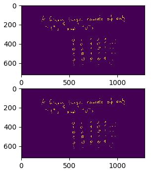

# [binary image compression with python and numpy](./2021-01-22_gen_light.html)
<center>
[*2021-01-22*](2021-01-22_gen_light.html)
</center>

[numpy-thonic run length compression](2021-01-22_gen_light.html) <a id = "NCE" href = "2021-01-22_gen_light.html">...</a>


I've been tinkering with my 
<a id = "NCE" href = https://github.com/kacpertopol/cam_board>cam_board</a> script.
This little program can turn a web cam into a white / black board. I found it handy in these rough, 
socially isolated, disease ridden times. The de-noising feature of the script is particularly
useful when recording the "blackboard" for students because it greatly reduces the video file sizes.
I was wondering if it would be possible to have a compression algorithm built into the script. 
Ideally, to reduce compression time, the compression procedure would rely heavily on the fast methods of the `numpy` library.
This post describes the resulting algorithm. This description is also part of an assignment where
I ask students to implement the same algorithm without `numpy` and compare compression times.
The script and sample image can be downloaded from 
<a id = "NCE" href = https://github.com/kacpertopol/rcnumpy>here</a>.


The script begins with two import statements in
\[compress.py line: 9\] 
:

```python
import numpy
import matplotlib.pyplot as plt
```

**Loading the binary image**

In our example we will be working with a 720 by 1280
image. The individual pixels in this image will contain
one of two values : 0 , 1. This means that
921600 bits or 115200 bytes are used to represent
the image.
The image data is stored in `image.npy` in a special
format designed to store `numpy` arrays. This file was
created using the `numpy.packbits` function and you can
verify that it is almost exactly 115200 bytes long.

The file is loaded and stored in variable `a` in
\[compress.py line: 67\] 
:

```python
a = numpy.load("image.npy")
```

and next it is unpacked (we might cover packing and unpacking during the course) in
\[compress.py line: 70\] 
:

```python
a = numpy.unpackbits(a)
```


Information about `a` is printed to the standard output in
\[compress.py line: 74\] 
:

```python
print("a.shape : " , a.shape)
print("a.dtype : " , a.dtype)
```


The first print statement will result in:
```
a.shape :  (921600,)
```
which means that we are dealing with a one dimensional
array of size 921600. This is used in
\[compress.py line: 79\] 
:

```python
length = a.shape[0:1]
```

to assign the length of `a` to a variable.
The second print statement will
result in:
```
 a.dtype :  uint8
```
from which we can gather that all values in this one dimensional array are
unsigned 8-bit integers.

The unpacked array of unsigned 8-bit integers can be saved to a file.
This is done in
\[compress.py line: 83\] 
:

```python
numpy.save("image_unpacked" , a)
```

and the resulting file `image_unpacked.npy` contains 921728 bytes. This
is almost eight times more then `image.npy`.

**Compression method**

The idea behind the compression method is simple.
More formally the algorithm that will be implemented
belongs to a family of *run time compression* algorithms.

Since the data we are working with is just a string of 0, 1 :
```
0 1 1 1 1 1 1 1 1 0 1 1 1 0 0 0 0 0 0 0 0 1 ...
```
it will be represented by the lengths of sequances
of ones and zeros that appear the sequence:
```
1 8 1 3 8 ...
```
This information together with the value of the first element of the sequence :
```
0
```
can be used to reconstruct the original image.

The value of the first element of `a` is assigned to a variable in
\[compress.py line: 138\] 
:

```python
first = a[0:1]
```

Notice that the variable `first` points to a `numpy` array and not a single value. This array was
created by taking a segment of `a` (`a[0:1]`), that is elements with indexes greater or equal to 0
and less then 1. This means that `first` is a one dimensional array with one element - the
first value in `a`. The choice to use an array with a single element instead of a single value
will be useful later when `first` will be concatenated with other arrays.

In order to obtain a lengths of sequences for the compression algorithm first a list
of indexes with non zero elements (ones) is created and assigned to a variable in
\[compress.py line: 142\] 
:

```python
nonzero = numpy.nonzero(a)[0]
```

The next lines
\[compress.py line: 146\] 
:

```python
start = numpy.nonzero((numpy.roll(nonzero,1) + 1) - nonzero)[0]
end = numpy.nonzero((numpy.roll(nonzero,-1) - 1) - nonzero)[0]
ones = end - start + 1
```

result in the variable `ones` containing a list of lenths of `1 , 1 , 1 , ...` sequences in `a`.
This code uses a combination of `numpy` functions. The reader is encouraged to try this code out
in `ipython` and read the documentation on these routines. The next lines of code
\[compress.py line: 152\] 
:

```python
ai = 1 - a

nonzero = numpy.nonzero(ai)[0]

start = numpy.nonzero((numpy.roll(nonzero,1) + 1) - nonzero)[0]
end = numpy.nonzero((numpy.roll(nonzero,-1) - 1) - nonzero)[0]
zeros = end - start + 1
```

result in the variable `zeros` containing a list of lengths of `0 , 0 , 0 , ...` sequences in `a`.

**Compressed data**

All the data necessary to reconstruct the original image is concatenated in
\[compress.py line: 175\] 
:

```python
data = numpy.concatenate(
        (
            length , 
            first , 
            zeros.shape[0:1] , 
            zeros , 
            ones.shape[0:1] , 
            ones
        ))
```

In order to firther save space, this array is rewritten using unigned 32-bit integers
in
\[compress.py line: 187\] 
:

```python
data = data.astype("uint32")
```


Finally the data is saved to `image_compressed.npy` in
\[compress.py line: 198\] 
:

```python
numpy.save("image_compressed" , data)
```

Notice that the size of this file is only 20892 bytes.

**Reconstructing the original image**

Now it is time to to check if it is possible to reconstruct
the original image from `image_compressed.npy`.
In the first step this file is loaded from disk
\[compress.py line: 212\] 
:

```python
comp = numpy.load("image_compressed.npy")
```


Next in
\[compress.py line: 232\] 
:

```python
l = comp[0]
f = comp[1]
zs = comp[2]
z = comp[3 : 3 + zs]
os = comp[3 + zs]
o = comp[3 + zs + 1:]
```

the

- length of `a`
- first element
- length of list with `0 0 0 ...` sequence lengths
- list of `0 0 0 ...` sequence lengths
- length of list with `1 1 1 ...` sequence lengths
- list of `1 1 1 ...` sequence lengths

are assigned to variables.

Next in
\[compress.py line: 251\] 
:

```python
rif = numpy.empty(zs + os , dtype = z.dtype)
val = numpy.empty(zs + os , dtype = z.dtype)

if(first == 0):
    rif[0::2] = z
    rif[1::2] = o
    val[0::2] = 0
    val[1::2] = 1
else:
    rif[0::2] = o
    rif[1::2] = z 
    val[0::2] = 1
    val[1::2] = 0
```

two, initialy empty, `numpy` arrays are created. `rif` will contain interwoven `0 0 0 ...` and `1 1 1 ...` sequence lengths
and `val` will contain the values (0 or 1) associated with the corresponding sequence length.
Note the `[0::2]` and `[1::2]` operators used for achieve this. They allow assigning values to every second element
of a `numpy` array starting with the first (index 0) or second (index 1) element.

The original array is reconstructed in
\[compress.py line: 278\] 
:

```python
reconstruct = numpy.repeat(val , rif)
reconstruct = reconstruct.astype("uint8")
```

and tested against the original array `a` in
\[compress.py line: 283\] 
:

```python
print("test against original : " , 
        numpy.array_equal(a , reconstruct))
```

using the `numpy.array_equal` function.

**Drawing the images**

In
\[compress.py line: 308\] 
:

```python
fig , axs = plt.subplots(2)
```

a plot containing two subplots is created. One subplot will contain
the original image and the other one will contain the reconstructed image.
In order to draw the images, the one dimensional arrays have to be reshaped
first in:
\[compress.py line: 312\] 
:

```python
img_compressed = a.reshape((720 , 1280))
img_reconstruct = reconstruct.reshape((720 , 1280))
```

Finally in
\[compress.py line: 317\] 
:

```python
axs[0].imshow(img_compressed)
axs[1].imshow(img_reconstruct)
plt.show()
```

the arrays are plotted and shown.

<center>

</center>


# [infinite matrices in *Mathematica*, part 3](./2021-01-19_gen_light.html)
<center>
[*2021-01-19*](2021-01-19_gen_light.html)
</center>

[mapping, addition, multiplication](2021-01-19_gen_light.html) <a id = "NCE" href = "2021-01-19_gen_light.html">...</a>


# [infinite matrices in *Mathematica*, part 2](./2021-01-17_gen_light.html)
<center>
[*2021-01-17*](2021-01-17_gen_light.html)
</center>

[representation, transposition](2021-01-17_gen_light.html) <a id = "NCE" href = "2021-01-17_gen_light.html">...</a>


# [infinite matrices in *Mathematica*, part 1](./2021-01-16_gen_light.html)
<center>
[*2021-01-16*](2021-01-16_gen_light.html)
</center>

[introduction, motivation](2021-01-16_gen_light.html) <a id = "NCE" href = "2021-01-16_gen_light.html">...</a>


# [hi](./2021-01-15_gen_light.html)
<center>
[*2021-01-15*](2021-01-15_gen_light.html)
</center>

[first post, what this blog is about](2021-01-15_gen_light.html) <a id = "NCE" href = "2021-01-15_gen_light.html">...</a>


